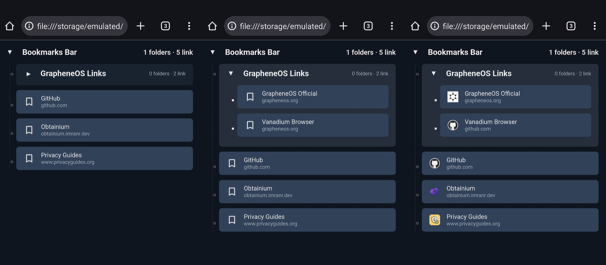

# GrapheneOS Vanadium Bookmarks Helper
A small utility to export Chromium-based browser bookmarks (including favicons) into an HTML+JS format that can be viewed and used directly inside the Vanadium browser on GrapheneOS.

---

## Disclaimer

This project is **not affiliated with GrapheneOS, the Vanadium browser, or their development teams** in any way.  
It is an independent, community-maintained tool provided "as is" with no warranty.  
Use at your own risk.


## Personal Note
I originally created this script for my own use, to have a bookmark synchronization system that Vanadium doesn't provide.
It is released under the MIT license — feel free to use, modify, or share it.
Review and verify the code before using it; I take no responsibility for how it is used or any consequences.
The project is intentionally simple: just a single HTML file and a short Python script.
Use it only after you’ve checked that it works as expected in your environment.

## Screenshots



## Prerequisites

- **Tested environment:**
  - Windows 11.
  - Ungoogled Chromium (source browser).
  - GrapheneOS with Vanadium (target browser).
- **Browser compatibility:**
  - Should work with bookmarks exported from any Chromium-based browser (Chrome, Edge, Brave, etc.).
  - Tested **only** with Ungoogled Chromium so far.
- **Required software:**
  - Python 3.x (for running the script), although the process can also be done manually.
  - Any method to copy files to the Vanadium scope storage folder (USB, Syncthing, etc.).


## Installation & Usage

### 1. Prepare Vanadium scope storage
This step is essential; without it, you won't have permission to access the `file:///...` path.   
On your GrapheneOS device:
1. Create a folder for Vanadium's scope storage (e.g. `VanadiumBookmarks`).
2. In **Settings → Apps → Vanadium → Scope storage**, grant Vanadium access to that folder.

*If “Storage Scopes” is not visible under Settings → Apps → Vanadium, go to Permissions → Photos and videos → Storage Scopes and enable it for the desired folder.*


## 2. Generate the bookmarks data

You have two options:

#### **Option A: Manual extraction**
1. Locate your Chromium-based browser `Bookmarks` file and copy elsewhere.
2. Rename it to `bookmarks_data.js`.
3. Open it in a text editor and:
   - Add this line at the very beginning:  
     ```js
     window.BOOKMARKS_JSON = 
     ```
   - Add a semicolon `;` at the very end of the file.
4. Copy the modified `bookmarks_data.js` and `bookmarks.html` to the Vanadium scope storage folder.

*Note: Favicons will not be imported — a default icon will be used instead.*


#### **Option B: Using the Python script** (recommended)
1. Edit the script to set your paths:
   ```python
   BOOKMARKS_SOURCE = Path(r"C:\Users\<YourUser>\AppData\Local\Chromium\User Data\Default\Bookmarks")
   FAVICONS_DB = Path(r"C:\Users\<YourUser>\AppData\Local\Chromium\User Data\Default\Favicons")

2. **Run the Python script**

   Run from the terminal or command prompt:

       python export_bookmarks.py

   This will generate two files in the `toSync` folder:

   - `bookmarks.html` — HTML viewer
   - `bookmarks_data.js` — bookmarks data with favicons embedded

   Copy both files to the Vanadium scope storage folder.

3. **Open the bookmarks in Vanadium**

   - On your GrapheneOS device, open Vanadium.
   - Navigate to:

         file:///storage/emulated/0/[YourScopeFolder]/bookmarks.html

   - *(Optional)* Add this page to Vanadium's bookmarks:  
     If Vanadium does not allow adding file URLs directly, add any website to bookmarks first, then edit it and replace the URL with the path above.


## Tips & Automation

- **Windows Task Scheduler**  
  Automate the Python script to run periodically by adding it to the Windows Task Scheduler.

- **File synchronization**  
  Use software like [Syncthing](https://syncthing.net/) to automatically sync the `bookmarks.html` and `bookmarks_data.js` files from your PC to the Vanadium scope storage folder.

- **Cross-browser support**  
  This method should work with most Chromium-based browsers — simply adjust `BOOKMARKS_SOURCE` and `FAVICONS_DB` in the Python script to match your browser's profile path.
